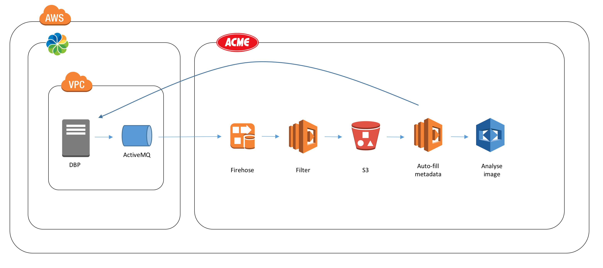

# Welcome

This repository contains an Alfresco extension that sends repository events to Kinesis Firehose and subsequently processes any new images uploaded, see the Architecture section below for more details.

# Architecture

TODO: Explain scenario

# Pre-requisites

Enterprise subscription/license.

TODO

# Build & Deploy

TODO